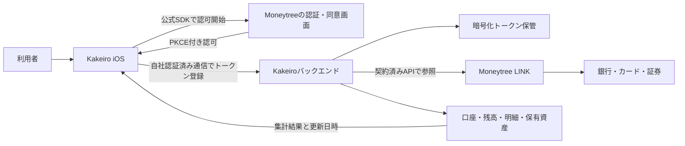

# 金融機関との自動連携

確認日: 2026年9月6日。公開された公式資料を確認した設計メモです。契約・アカウント登録・実口座への接続は実施していません。

Kakeiro の初期版は、銀行・証券・クレジットカードを手動登録して管理するアプリです。金融機関名を選択しても、その金融機関へのログインや自動取得は始まりません。下記は自動連携を追加するための調査・設計で、稼働中の機能ではありません。

## 優先する6機関

Moneytree と Moneytree LINK の[公式対応一覧](https://institutions.moneytree.jp/index.html)は、2026年9月3日時点の一覧として、下記6機関を「対応済み」と掲載しています。ただし、掲載は Kakeiro に API 利用権があることや、すべての口座・認証方法・金融商品が取得できることを意味しません。

| 金融機関 | 種別 | 確認できた事実と実装前の確認事項 |
| --- | --- | --- |
| SBI証券 | 証券 | [個別ページ](https://institutions.moneytree.jp/institutions/sbi_securities)では対応済み。現金・国内株・米国株・投資信託・NISAの取得範囲を実口座で個別確認する。パスキー等の条件は下記参照。 |
| 楽天証券 | 証券 | [個別ページ](https://institutions.moneytree.jp/institutions/rakuten_securities)では対応済み。一方、2026年8月20日付の[非対応機能の案内](https://help.getmoneytree.com/ja/articles/7881362-未対応-非対応の金融サービスについて)はログイン追加認証を未対応としている。自動連携可能と断定しない。 |
| 楽天銀行 | 銀行・個人口座 | [LINK専用FAQ](https://help.getmoneytree.com/ja/articles/6038789-moneytree-link-楽天銀行への接続はできないのですか)（2025年1月20日）は、一部提携アプリのみ登録可能、更新は1日1回まで、普通口座のみで定期預金は対象外と説明。Kakeiro が提供対象となれるかを最優先で確認する。 |
| 三井住友銀行 | 銀行・個人口座 | 公式対応一覧では対応済み。法人のWeb21やValueDoorとは別の個人口座として、契約上の取得範囲・更新間隔・再認証条件を確認する。 |
| 三菱UFJ銀行 | 銀行・個人口座 | 公式対応一覧では対応済み。[銀行の三菱UFJダイレクトAPI対象サービス一覧](https://www.bk.mufg.jp/innovation/api/partner/direct/directapi_externalserviceproviders.pdf)にもMoneytreeを掲載。BizSTATIONの法人向け要件を個人口座に適用しない。 |
| ゆうちょ銀行 | 銀行・個人口座 | 公式対応一覧の「ゆうちょ銀行（郵便局）」が対応済み。個人口座の取得項目、履歴期間、再認証方法は契約後の仕様・検証で確定する。 |

SBI証券・楽天証券について、Moneytree の[パスキーに関する公式FAQ](https://help.getmoneytree.com/ja/articles/14320799-金融機関や証券会社のサイトで-パスキー-passkeys-を設定していますが-moneytreeと連携できますか)（表示日2026年7月17日）は、パスキー必須の利用者では接続できない場合があると説明しています。Kakeiro の連携のために利用者へ認証保護を弱める操作を促す設計にはせず、接続できない口座は手動管理を続けられるようにします。

クレジットカードは当初要望に含まれますが、対象のカード会社・カード種類は未指定です。銀行の選択から同系列のカード契約を推定せず、別の口座として取り扱います。

## 接続方式の候補

### Moneytree LINK

現時点の第一候補です。銀行・カード・証券を共通APIで扱い、利用者の同意によるデータ共有を行う製品です。[公式製品概要](https://docs.link.getmoneytree.com/docs/product-and-tech-overview)

検証環境と本番環境は分離され、それぞれ接続情報の事前登録が必要です。本番接続情報は原則契約締結後に提供されます。検証用Moneytreeアカウントも本番とは別に必要です。[環境および接続](https://docs.link.getmoneytree.com/docs/api-domain)、[検証環境FAQ](https://faq.getmoneytree.com/test-environment)

検証環境には銀行・カード・証券のテスト口座と、認証失敗・OTP要求・ページングなどの検証用データがあります。これはAPI実装検証用であり、Kakeiroの画面で表示するサンプルデータとは別物です。[テストデータ](https://docs.link.getmoneytree.com/docs/test-data)

料金、個人開発者としての契約可否、最低利用条件、6機関へのアクセス、投資APIの利用権限は未確認です。「無料の個人用APIキーを発行すれば連携完了」とは扱いません。また、名称の似た[LINK API Private](https://getmoneytree.com/jp/link/link-api-private)は自社システムへの銀行入出金データ連携を案内する製品で、銀行・カード・証券を扱う個人向けiPhoneアプリの用途を満たすと決めつけません。

### Zaim API

[公式開発者ページ](https://dev.zaim.net/)はZaim内の家計簿項目の登録・一覧取得を案内しています。しかしAPI仕様ページは今回ログイン画面に遷移し、現在の自動取得明細の公開範囲を公式仕様本文で確認できませんでした。[仕様への入口](https://dev.zaim.net/home/api)

Zaim自身が銀行とAPI連携する機能と、第三者アプリがZaim API経由でその銀行明細を取得できることは別です。公開案内のみを根拠に、6機関の資産・明細を取り込める基盤として採用しません。利用を検討する場合は、開発者登録後に銀行由来の明細・残高・証券保有データの取得可否を仕様と提供元に確認します。[Zaimの銀行API連携の説明](https://content.zaim.net/questions/show/577)、[API利用規約](https://dev.zaim.net/portal/tos)

### Money Forward

[公式クラウド開発者サイト](https://developers.biz.moneyforward.com/)で確認できるAPIは会計・経費・請求書などの業務サービス用です。今回の公開資料調査では、個人開発者がMoney Forward MEの全連携口座を取得するためのセルフサービスAPI・発行手順を確認できませんでした。MEのログイン情報や非公開エンドポイントを利用する実装は含めません。

金融機関等へのアグリゲーション提供事例はありますが、これは別途導入を相談するサービスです。[Money Forwardの公式導入事例](https://corp.moneyforward.com/news/release/service/20210322-mf-press/)

## 将来の構成案

以下はKakeiro向けの設計案です。現時点でバックエンドやOAuth接続処理は提供していません。

Moneytreeの公式構成では、iOS SDKでAuthorization Code Grant with PKCEを使ってトークンを取得し、バックエンドへ送って管理します。SDKを使う認可フローを採用し、独自に銀行のログインフォームを作りません。SDKは金融データAPI呼び出し自体を代行するものではないため、データ取得アダプターは別途必要です。[SDK技術概要](https://docs.link.getmoneytree.com/docs/link-sdk-overview)、[バックエンド構成の説明](https://docs.link.getmoneytree.com/docs/product-and-tech-overview)

| 部分 | Kakeiroで実装する内容 |
| --- | --- |
| iOS認証 | 自社アカウント認証とMoneytree連携を分離。公式SDKに登録済みclient ID・redirect URIを設定し、認可結果を利用者の自社セッションに結び付ける。 |
| 秘密情報 | backendの秘密鍵・client secret・refresh tokenはリポジトリに保存しない。サーバーは秘密管理基盤、端末の短期セッションはKeychainを使う。金融機関のパスワードはKakeiroの入力欄・保存データに持たせない。 |
| アクセス制御 | 自社ユーザーIDとプロバイダーのユーザーID・口座IDをサーバーで結び付け、各リクエストで所有関係を検証。読取に必要な権限のみ要求する。 |
| 取得アダプター | 銀行・カードの口座/明細と、投資口座/保有資産のAPIを別に扱う。接続先とレスポンスは契約時の仕様で確定し、架空のURL・サンプル応答を本番処理に使わない。 |
| 同期 | プロバイダーIDを使って同じ明細の再取得を重複登録にしない。ページング、取消・変更、過去期間の再取得、レート制限時の待機を扱う。 |
| 接続状態 | 未連携・認可待ち・同期中・連携済み・再認証が必要・一時停止・解除済みを区別。データ取得成功時のみ最終更新日時を進める。 |
| 削除/解除 | 連携解除時に更新ジョブを停止し、プロバイダー側の失効処理、トークン削除、取得データの保持/削除方針を実装する。 |

投資用口座APIには専用のOAuthスコープがあり、銀行明細のAPIだけで証券をカバーできません。必要な権限・取得可能なデータは契約時に確定します。[投資用口座API](https://docs.link.getmoneytree.com/reference/get-link-investments-accounts)

## 集計で守ること

これはKakeiroの計算上の方針です。プロバイダーから受け取った値を、そのまま家計支出へ足し込まないようにします。

- カード利用時に支出を計上し、後日の銀行引落しはカードへの振替として扱う。同一支出を二重計上しない。
- 銀行と証券間の入出金は資金移動として収支から除外する。
- 資産残高と家計簿の月間収支を分ける。投資評価額の変動は給与等の収入ではない。
- 証券の口座合計と保有銘柄の評価額を同時に足さない。預り金の包含関係を確認する。
- 通貨と評価日時を保持し、外貨資産を最新の円換算値と誤認させない。
- 取得できなかった残高を0円に置き換えない。直近成功値と更新日時を表示する。

## 自動連携開始までに必要な作業

1. Kakeiroの用途・提供主体・対象ユーザー数を整理し、6機関と対象カードを含む契約条件・費用を提供元へ確認する。特に楽天銀行の利用資格と証券2社の認証対応を先に確定する。
2. 契約/検証用client登録、必要スコープ、iOS SDK、redirect URI、検証用ユーザーを用意する。
3. backend、トークン管理、データアダプター、接続状態表示を実装する。
4. テスト口座で認可取消・期限切れ・OTP・通信失敗・ページング・重複取得を検証する。
5. 本番利用が承認された後、利用者自身による同意操作で6機関を接続し、残高・明細・保有資産・更新頻度を実口座で照合する。
6. 検証済みの機関・口座種類だけをアプリ上で自動連携可能と表示する。

銀行ごとの直接API契約を選ぶ場合は、銀行ごとの接続・運用条件が別途必要です。アグリゲーターを使う場合も、Kakeiroに認められるデータ範囲と利用目的は契約で確認します。本メモでは法的登録の要否を断定していません。
