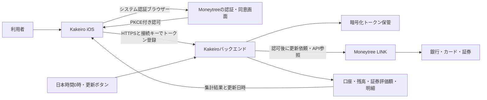

# 金融機関との自動連携

確認日: 2026年9月7日。公開された公式資料と、Kakeiroに追加した自動同期の実装をまとめています。API契約・クライアント登録・実口座への接続は実施していません。

Kakeiroは自動連携を中心にし、手動入力・CSVで補足する構成へ変更しました。iPhone側の認可・更新画面と、Moneytree LINKを読み取るバックエンド、更新ボタン・日本時間0時の更新依頼処理を実装しています。**本番の金融機関連携はまだ利用開始していません。** 動作にはMoneytreeの利用承認と登録情報、稼働中のサーバー、利用者本人の同意が必要です。

契約・接続に必要な確認事項は[接続準備チェックリスト](ConnectionSetupChecklist.md)、サーバー設定と検証条件は[バックエンド設定](BackendSetup.md)を参照してください。

## 金融機関の対応確認

利用したい銀行・カード・証券会社について、Moneytree LINKの[公式対応一覧](https://institutions.moneytree.jp/index.html)と契約上の提供範囲を確認してください。対応一覧への掲載は、すべてのアプリ・口座種類・認証方法で接続できることを意味しません。金融機関ごとの提携条件、追加認証、取得項目、更新間隔を個別に確認します。

アプリに表示する金融機関の候補は、利用者の保有口座を示すものではありません。接続のために認証保護を弱める設定変更を前提にせず、接続できない口座は手動管理を続けられるようにします。

## 接続方式の候補

### Moneytree LINK

今回のアダプターの実装先です。銀行・カード・証券を共通APIで扱い、利用者の同意によるデータ共有を行う製品です。[公式製品概要](https://docs.link.getmoneytree.com/docs/product-and-tech-overview)

検証環境と本番環境は分離され、それぞれ接続情報の事前登録が必要です。本番接続情報は原則契約締結後に提供されます。検証用Moneytreeアカウントも本番とは別に必要です。[環境および接続](https://docs.link.getmoneytree.com/docs/api-domain)、[検証環境FAQ](https://faq.getmoneytree.com/test-environment)

検証環境には銀行・カード・証券のテスト口座と、認証失敗・OTP要求・ページングなどの検証用データがあります。これはAPI実装検証用であり、Kakeiroの画面で表示するサンプルデータとは別物です。[テストデータ](https://docs.link.getmoneytree.com/docs/test-data)

公式FAQは初期費用・月額利用料が発生すると案内しています。金額、個人開発者としての契約可否、最低利用条件、対象金融機関へのアクセス、投資APIの利用権限は未確認です。[公式費用FAQ](https://faq.getmoneytree.com/cost)。「無料の個人用APIキーを発行すれば連携完了」とは扱いません。また、名称の似た[LINK API Private](https://getmoneytree.com/jp/link/link-api-private)は自社システムへの銀行入出金データ連携を案内する製品で、銀行・カード・証券を扱う個人向けiPhoneアプリの用途を満たすと決めつけません。

### Zaim API

[公式開発者ページ](https://dev.zaim.net/)はZaim内の家計簿項目の登録・一覧取得を案内しています。しかしAPI仕様ページは今回ログイン画面に遷移し、現在の自動取得明細の公開範囲を公式仕様本文で確認できませんでした。[仕様への入口](https://dev.zaim.net/home/api)

Zaim自身が銀行とAPI連携する機能と、第三者アプリがZaim API経由でその銀行明細を取得できることは別です。公開案内のみを根拠に、銀行・カード・証券の資産・明細を取り込める基盤として採用しません。利用を検討する場合は、開発者登録後に銀行由来の明細・残高・証券保有データの取得可否を仕様と提供元に確認します。[Zaimの銀行API連携の説明](https://content.zaim.net/questions/show/577)、[API利用規約](https://dev.zaim.net/portal/tos)

また、同API利用規約の第16条第6号には競合する事業・商品・サービスに関する禁止事項があります。Kakeiroへの適用確認が必要であり、無料代替としてそのまま採用できるとは判断していません。

### Money Forward

[公式クラウド開発者サイト](https://developers.biz.moneyforward.com/)で確認できるAPIは会計・経費・請求書などの業務サービス用です。今回の公開資料調査では、個人開発者がMoney Forward MEの全連携口座を取得するためのセルフサービスAPI・発行手順を確認できませんでした。MEのログイン情報や非公開エンドポイントを利用する実装は含めません。

金融機関等へのアグリゲーション提供事例はありますが、これは別途導入を相談するサービスです。[Money Forwardの公式導入事例](https://corp.moneyforward.com/news/release/service/20210322-mf-press/)

## 実装した構成

以下はコード上の構成です。図に含まれるMoneytree・金融機関との本番通信や、常時稼働サーバーの運用は未開始です。

今回のiOS実装は`ASWebAuthenticationSession`でMoneytreeの公式認可ページを開き、Authorization Code Grant with PKCE（S256）でトークンを取得します。公式SDKは組み込んでいません。登録済みPublic Clientと`kakeiro://moneytree/callback`の戻り先が必要です。トークンをHTTPS経由でバックエンドへ渡す構成で、金融機関のログインフォームはKakeiroに持たせていません。[公式OAuthフロー](https://docs.link.getmoneytree.com/docs/obtaining-an-access-token)、[認可要求仕様](https://docs.link.getmoneytree.com/reference/post-oauth-authorize)

| 部分 | Kakeiroの実装内容 |
| --- | --- |
| iOS認証 | 公開された認可・トークンURLを使い、PKCE、state、戻り先、必要なスコープを検査する。 |
| 秘密情報 | 端末のサーバー接続設定はKeychain。サーバーは環境設定の暗号化鍵を使い、トークン・保存データを暗号化する。秘密値をリポジトリに置かない。 |
| アクセス制御 | 1台のサーバーを1人の所有者用とし、接続キーで認証する。Moneytreeの`moneytree_id`を照合し、別の利用者への切替を拒否する。一般公開用の複数利用者アカウント基盤は未実装。 |
| 取得アダプター | 日本の検証／本番APIを環境で分け、銀行・カードと証券を別のエンドポイントから取得する。証券の`account_detail_type`に応じて保有資産／取引明細APIを選ぶ。 |
| 同期 | 全ページを取得・検査し、プロバイダーIDで自動取得分を置換する。手動・CSVの記録は保持する。同期途中の失敗で一部だけを取り込まない。 |
| 更新の起点 | 更新ボタンからの依頼と日本時間0時の定期依頼を同じバックエンドで処理する。取得成功を確認してから最終成功日時を進める。 |
| 解除 | 以後の取得を停止してサーバーのトークンを削除し、Moneytree側にも連携取消を依頼する。保存済みの口座・明細は残す。提供元への取消が確認できない場合はその状態を表示する。 |

投資用口座APIには専用のOAuthスコープがあり、銀行明細のAPIだけで証券をカバーできません。必要な権限・取得可能なデータは契約時に確定します。[投資用口座API](https://docs.link.getmoneytree.com/reference/get-link-investments-accounts)

### 現在の範囲と実口座検証前の制限

- 自動取り込みの金額は円建て口座を対象とします。外貨や未対応の口座種類、未取得・不正な金額を含む場合は前回の保存データを保持してエラーを表示します。外貨を0円や推測レートで取り込みません。
- 証券は口座単位の評価額を資産へ反映します。保有資産APIのページ取得も行いますが、銘柄ごとの詳細画面・保有数量の編集は今回の実装対象に含みません。
- デビットカード・電子マネー・ローンなど、残高の意味や明細重複の照合が必要な口座は未対応です。Moneytreeに登録された口座構成によって、取り込み全体が完了しない場合があります。
- API応答を模したテストと実口座照合は別です。銀行・カードの金額符号、返金、同じ金融機関を複数回登録した際の重複、カテゴリ判定、証券の現金・評価額の包含関係は、利用承認後に提供元の説明と実データで照合します。

### 0時更新の条件

日本時間0時はサーバーが更新を**依頼する時刻**です。サーバーが停止・スリープ・オフラインの場合、定刻に実行できません。iPhone側のバックグラウンド実行時刻はOSが決めるため、サーバーの更新結果は起動時やOSが許可した実行時に端末へ反映します。[Appleの実行時刻仕様](https://developer.apple.com/documentation/backgroundtasks/bgtaskrequest/earliestbegindate)

Moneytreeへの更新依頼は1利用者につき1日4回までで、日本時間0時にリセットされます。202は受付であり、完了ではありません。アカウントグループの`last_aggregated_success`と状態を確認してからデータを取り込みます。金融機関ごとの上限や追加認証により、更新できない口座があります。[同期依頼API](https://docs.link.getmoneytree.com/reference/post-link-profile-refresh)、[取得成功日時](https://docs.link.getmoneytree.com/docs/account-metadata)

## 集計で守ること

これはKakeiroの集計方針と実口座での検証事項です。すべての金融機関で正しく判定できると確認したものではありません。

- カード利用時に支出を計上し、後日の銀行引落しはカードへの振替として扱う。同一支出を二重計上しない。
- 銀行と証券間の入出金は資金移動として収支から除外する。
- 資産残高と家計簿の月間収支を分ける。投資評価額の変動は給与等の収入ではない。
- 証券の口座合計と保有銘柄の評価額を同時に足さない。預り金の包含関係を確認する。
- 通貨と評価日時を検査し、現段階では外貨口座を取り込まない。
- 取得できなかった残高を0円に置き換えない。直近成功値と更新日時を表示する。

## 自動連携開始までに必要な作業

1. Kakeiroの用途・提供主体・対象ユーザー数を整理し、対象金融機関を含む契約条件・費用・認証方式への対応を提供元へ確認する。
2. 契約／検証用Public Client登録、必要スコープ、redirect URI、検証用ユーザーを用意する。
3. 実装済みバックエンドの接続・暗号化設定を行い、常時稼働する環境とHTTPSを用意する。[バックエンド設定](BackendSetup.md)
4. 提供元の検証環境で認可取消・期限切れ・OTP・通信失敗・ページング・重複取得・返金・部分更新を検証する。モックテストだけで利用可能とは判断しない。
5. 本番利用が承認された後、利用者自身による同意操作で対象金融機関を接続し、残高・明細・保有資産・更新頻度を実口座で照合する。
6. 検証済みの機関・口座種類だけをアプリ上で自動連携可能と表示する。

銀行ごとの直接API契約を選ぶ場合は、銀行ごとの接続・運用条件が別途必要です。アグリゲーターを使う場合も、Kakeiroに認められるデータ範囲と利用目的は契約で確認します。本メモでは法的登録の要否を断定していません。
